> ## 基于图像纹理特征和语义特征融合的多模态AI生成人脸图像鉴别模型
>

|    队伍    |     学校     |         成员         |
| :--------: | :----------: | :------------------: |
| 黑盒自动机 | 华南师范大学 | 黄俊銓 梁志标 李俊坚 |


## 环境依赖

本项目的额外依赖库记录在`./src/requirements.txt`中，所有的深度学习技术实现都是基于Pytorch框架。

------


## 模型配置

- **SigLIP-PatchCraft**模型的**SigLIP**模型配置信息位于`./src/Configs`目录中，格式为json。
- **SigLIP-PatchCraft**模型权重位于`./src/Configs/best.pt`(需下载)。
- 模型实现代码位于`./src/Model`目录中。

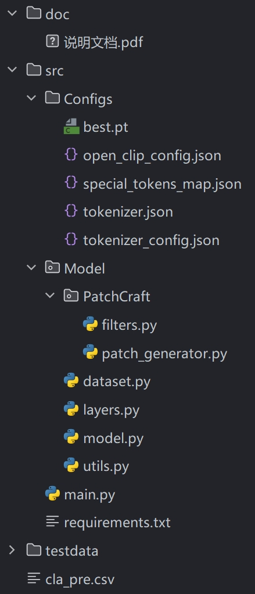

------


## 运行示例

模型权重(780.62MB)下载链接: https://pan.baidu.com/s/1dTe-ozABNI95nXTeSFV-bA?pwd=ernh	提取码: ernh

下载模型权重`best.pt`后，迁移至`./src/Configs`目录中。

在父目录中执行终端命令`python ./src/main.py`，即可对`./testdata`目录下的图片进行预测，预测结果将保存在`./cla_pre.csv`。

------


## 模型架构

本项目使用**SigLIP-PatchCraft**模型融合，代码存放于`./src/Model`。**PatchCraft**模型着重关注图像的纹理特征，**SigLIP**模型着重理解图像的语义信息，通过融合纹理和语义特征，进一步提高模型的预测精度和泛化能力。


### PatchCraft

论文：[[2311.12397\] PatchCraft: Exploring Texture Patch for Efficient AI-generated Image Detection](https://arxiv.org/abs/2311.12397)

基于AI生成图像的特点，研究人员发现，由AI模型生成的图像，在纹理丰富区与纹理贫乏区的差异，要显著异于真实图像。

AI生成的图像在纹理丰富区与纹理贫乏区的纹理细节表现不一致，而真实图像的纹理细节通常表现一致。

通过特定的纹理特征提取方法，可以增强这一纹理细节差异度，进而促进判别器模型的学习和理解。

**PatchCraft**模型并不考虑图像的语义信息，所以其能在非人脸数据上保持良好的泛化性，不会受到不符要求的图像语义信息的影响。

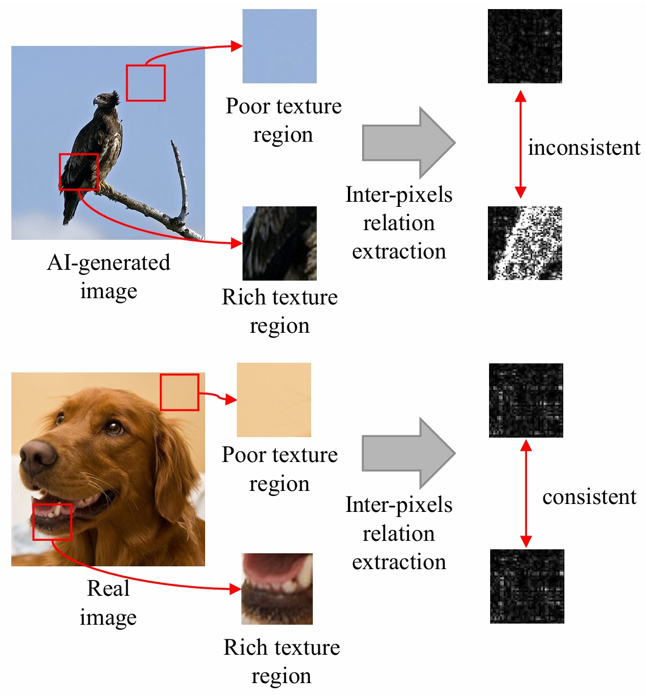

**PatchCraft**的模型架构如下：

1. 首先原始图像会被切分成若干个等尺寸的小块
2. 之后依据这些小块的纹理复杂度，将其重建为纹理丰富图和纹理贫乏图
3. 接着对这两个特征图应用特定的高通滤波器，进一步增强图像的纹理特征
4. 再对这两个纹理特征图应用独立的卷积层和HardTanh激活函数，初步提取纹理特征
5. 最后输入两个纹理特征图的差值到判别器模型中(通常为卷积模型)进行特征提取和训练，预测结果

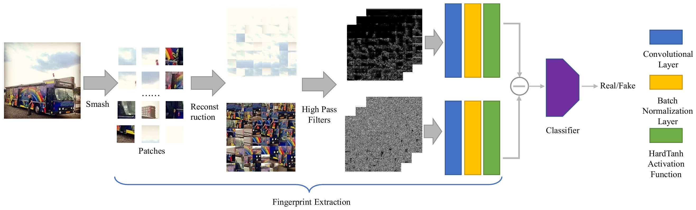

**PatchCraft**涉及的图像处理方法代码在`./src/Model/PatchCraft`中，我们复现并改进了相关代码，大大提高了图像处理速度。

重建(Reconstruction)处理示例如下：

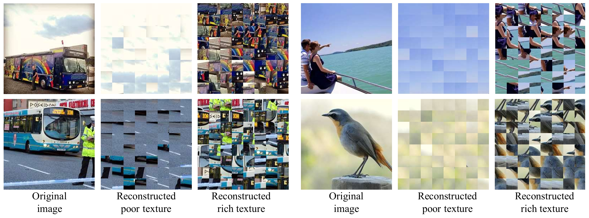

图像的纹理复杂度由各个方向上的像素差异值之和来衡量，具体计算代码如下：

```python
def get_pixel_var_degree(p: np.array) -> int:
    l1 = np.abs(np.diff(p, axis=1)).sum()                            # 水平方向上的像素差异之和
    l2 = np.abs(np.diff(p, axis=0)).sum()                            # 垂直方向上的像素差异之和
    l3 = np.abs(p[:-1, :-1] - p[1:, 1:]).sum()                       # 主对角线方向上的像素差异之和
    l4 = np.abs(p[:-1, 1:] - p[1:, :-1]).sum()                       # 反对角线方向上的像素差异之和

    return l1 + l2 + l3 + l4
```

此处，我们用所有Patch的纹理复杂度的平均值作为划分纹理丰富和贫乏的界线：

```python
def extract_textures(values, patches):

    threshold = np.mean(values)                                      # 平均纹理丰富度(设为阈值)
    rich_idx = (values > threshold)                                  # 纹理丰富块的下标
    poor_idx = ~rich_idx                                             # 纹理贫乏块的下标
    rich_patches, rich_values = patches[rich_idx], values[rich_idx]  # 纹理丰富块，纹理复杂度
    poor_patches, poor_values = patches[poor_idx], values[poor_idx]  # 纹理贫乏块，纹理复杂度

    return rich_patches, rich_values, poor_patches, poor_values
```

对纹理特征图应用的高通滤波器有以下7组：

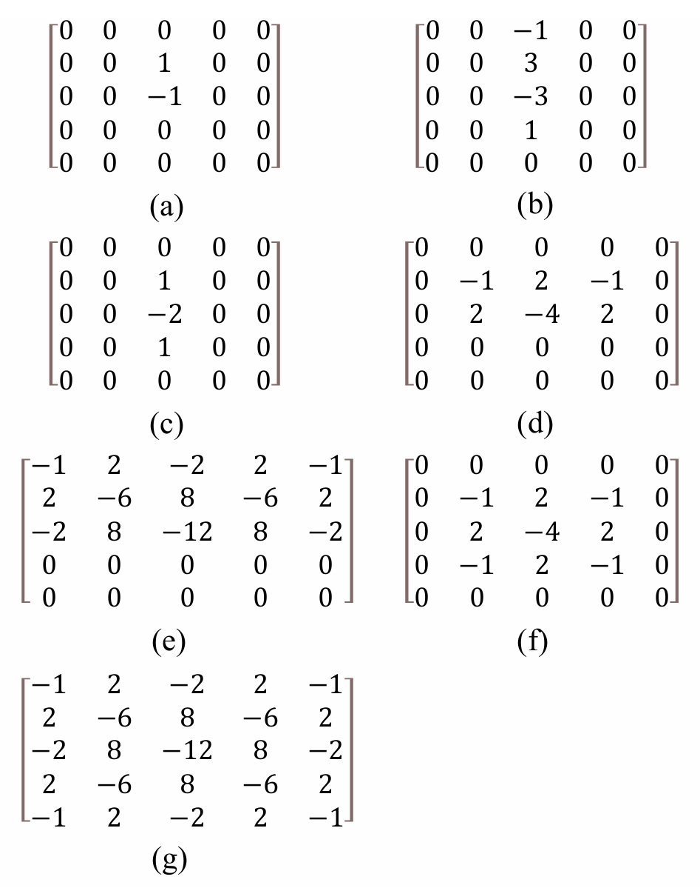

对这7组滤波器进行特定方向上的旋转，最终得到30个滤波器。

接着将这30个高通滤波器应用在两个纹理特征图上，实现代码如下：

```python
filters = [f1, f2, f3, f4, f5, f6, f7]                                   # 7组30个高通滤波器

def apply_filters(src: np.ndarray):
    src = np.copy(src)
    imgs = []
    for fs in filters:
        img = cv2.filter2D(src=src, kernel=fs[0], ddepth=-1)
        for f in fs[1:]:
            img = cv2.add(img, cv2.filter2D(src=src, kernel=f, ddepth=-1))
        imgs.append(img // len(fs))
    img = cv2.cvtColor(np.sum(imgs, axis=0, dtype=np.uint8), cv2.COLOR_RGB2GRAY) // len(imgs)
    threshold = np.median(img) + 2
    return cv2.threshold(img, threshold, 255, cv2.THRESH_BINARY)[1]      # 二值化阈值处理
```

本模型中具体的**PatchCraft**模型配置代码如下：

```python
IMAGE_SIZE = 512  # 图像分辨率为512x512
PATCH_SIZE = 32  # 划分小块的分辨率为32×32
PATCH_NUM = 512 // PATCH_SIZE  # 划分小块的数量为16×16
TOTAL_PATCH = PATCH_NUM ** 2  # 256
```

```python
class TextureEncoder(nn.Module):
    def __init__(self, dim):
        super(TextureEncoder, self).__init__()
        block_nums = [6, 6, 4, 4]
        self.rich_texture = ConvBlock(1, dim, activation=nn.Hardtanh())  # 提取纹理丰富特征
        self.poor_texture = ConvBlock(1, dim, activation=nn.Hardtanh())  # 提取纹理贫乏特征
        self.classifier = nn.Sequential(                                 # 卷积特征提取判别器
            ConvBlock(dim, n_blocks=block_nums[0]),                      # 6层卷积
            nn.AvgPool2d(kernel_size=2),                                 # 平均池化
            ConvBlock(dim, n_blocks=block_nums[1]),                      # 6层卷积
            nn.AvgPool2d(kernel_size=2),                                 # 平均池化
            ConvBlock(dim, n_blocks=block_nums[2]),                      # 4层卷积
            nn.AvgPool2d(kernel_size=2),                                 # 平均池化
            ConvBlock(dim, n_blocks=block_nums[3]),                      # 4层卷积
            nn.AdaptiveAvgPool2d(1),                                     # 自适应全池化
            nn.Flatten(1)                                                # 展平特征向量
        )

    def forward(self, rt, pt):
        x = self.rich_texture(rt) - self.poor_texture(pt)                # 计算贫富纹理差异
        y = self.classifier(x)                                           # 卷积提取特征
        return y  # (B, D)
```


### SigLIP

论文：[[2303.15343\] Sigmoid Loss for Language Image Pre-Training](https://arxiv.org/abs/2303.15343)

论文实验发现，**PatchCraft**模型在失真、降分辨率的图像上精度表现会大打折扣，原因是**PatchCraft**只关注于图像的像素差异，原始像素细节的损失会削弱AI生成图像和真实图像之间的纹理特征差异。

考虑到比赛数据集中的图像大多都经过压缩、调色等处理，为了保证精度，模型不能单一地关注纹理特征，还要考虑具体图像的语义特征，例如面部表情、动作、背景等。

我们选用预训练多模态模型**ViT-B-16-SigLIP-512**，其具有以下优势：

- 模型在大规模数据集webli上进行充分预训练，对图像的语义信息具有深刻的理解
- 图像端的输入分辨率为512×512，输入分辨率较高，能保留更多的图像细节
- 模型仅需要少量的训练数据进行微调，即可快速收敛，达到相当高的精度
- 可以自行构造文本端的Prompts，合理的Prompts更有利于模型对图像内容的理解

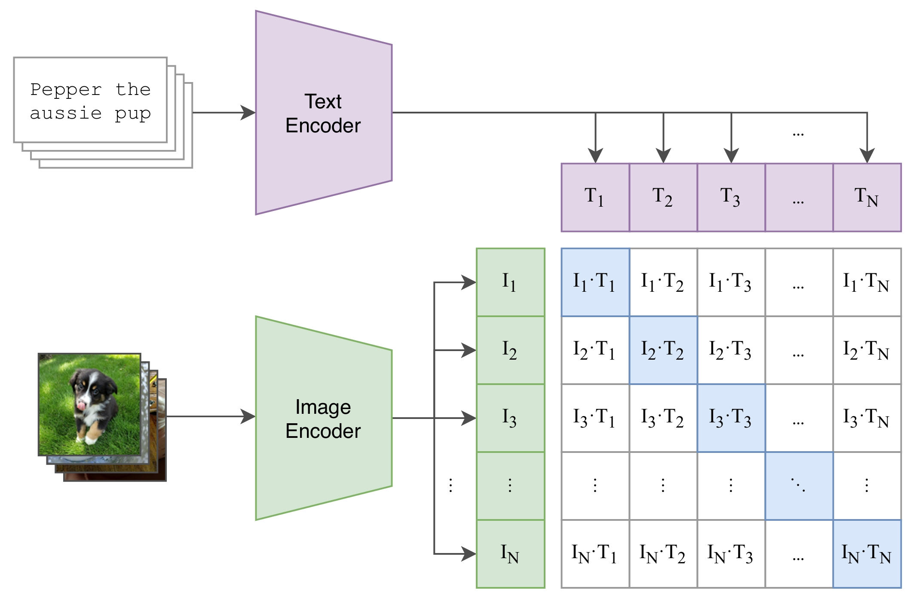

在文本端，我们构造了两段利于模型理解的Prompts，分别代表真实的图像和AI生成的图像：

|       真实的图像        |     AI生成的图像      |
| :---------------------: | :-------------------: |
| Image created by humans | Image generated by AI |

图像的特征向量会与这两个文本的特征向量计算点积相似度，取最大相似度值的文本作为预测标签。

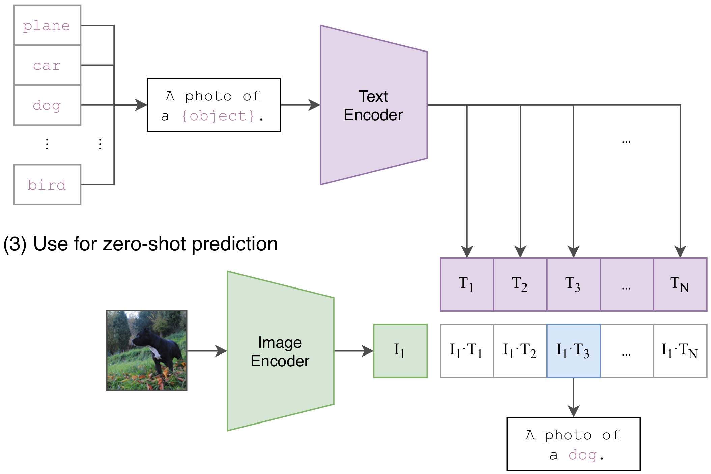

**SigLIP**模型相比于**CLIP**模型，还改进了损失函数，将以**Softmax**作为激活函数的**CrossEntropy**损失改进为以**Sigmoid**作为激活函数的**BinaryCrossEntropy**损失。

改进后的损失函数在小批量的训练上能实现更快收敛，计算成本也更低，并且能达到更高的预测精度。

|                     CLIP损失计算方式                     |                    SigLIP损失计算方式                     |
| :------------------------------------------------------: | :-------------------------------------------------------: |
| 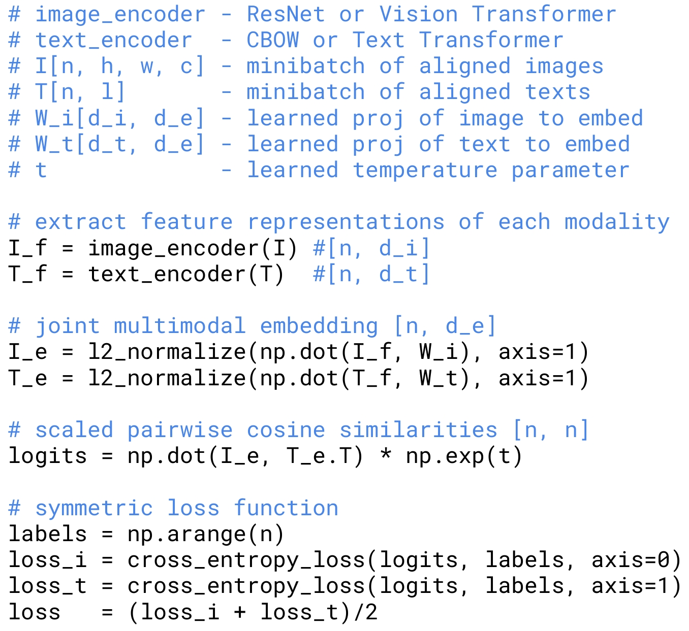 | 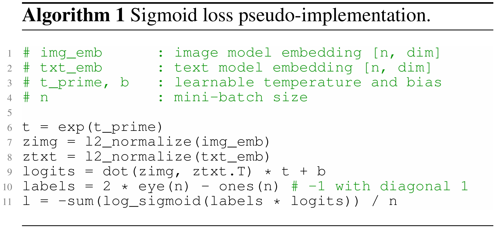 |

**SigLIP**损失的代码实现(基于Pytorch)

```python
def get_loss(logits, labels, reduction='mean'):
    log_p = F.logsigmoid(logits)  # (N, N)
    log_not_p = F.logsigmoid(-logits)  # (N, N)
    nll = -torch.sum(labels * log_p + (1. - labels) * log_not_p, dim=-1)  # (N, )
    return nll.mean() if reduction == 'mean' else nll
```

本**SigLIP**模型选用了**ViT-B/16**作为图像编码器，在图像特征提取上具备强大的全局上下文建模能力。

ViT 利用了 Transformer 在处理序列数据时捕捉全局信息的优势。与 CNN 不同，CNN 基于局部感受野进行特征提取，而 Transformer 通过自注意力机制（Self-Attention）可以在整个输入图像中建立全局依赖关系。每个 patch 之间可以直接交互，捕捉图像中不同区域之间的关系。因此，ViT 可以更好地理解图像中的全局上下文，有助于更复杂的图像分析任务。

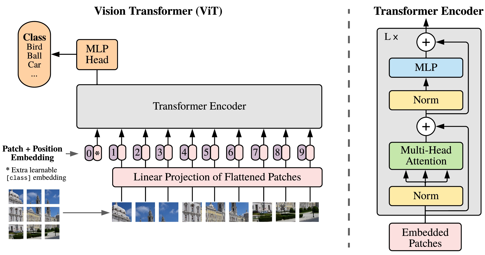

**ViT-B/16**的模型参数如下：

|      参数      | 数值 |
| :------------: | :--: |
|  自注意力层数  |  12  |
|  自注意力头数  |  12  |
| 隐藏层特征维数 | 768  |
|   Patch边长    |  16  |
|     参数量     | 86M  |


### PatchCraft-SigLIP

**SigLIP-PatchCraft**模型融合了图像的纹理特征和语义特征，并且保留了多模态模型对图像的语言描述的理解能力。

**PatchCraft**模型着重关注图像的纹理特征，**SigLIP**模型着重理解图像的语义信息，通过融合纹理和语义特征，进一步提高模型的预测精度和泛化能力。

整体模型架构如下图所示：

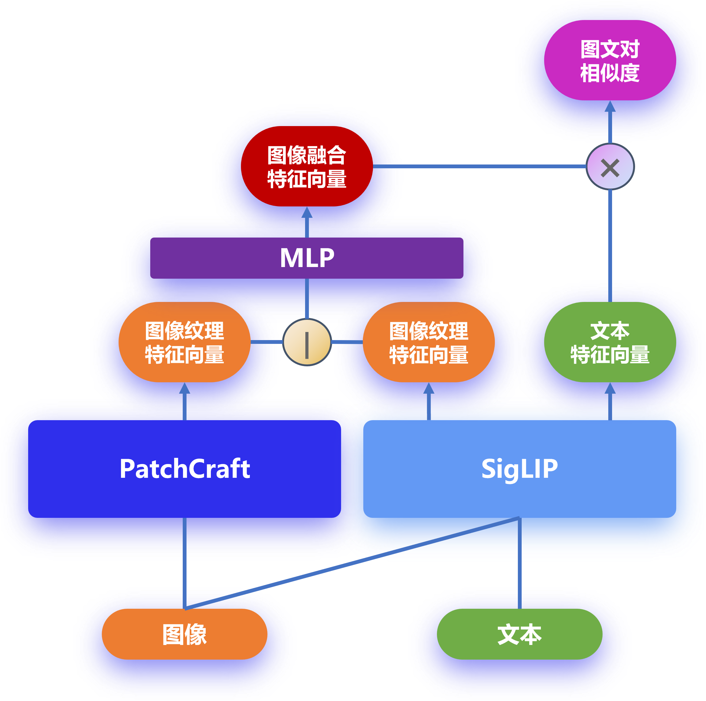

**PatchCraft-SigLIP**模型实现的关键代码如下(**SigLIP**的实现调用了OpenCLIP库)：

```python
class Model(nn.Module):
    def __init__(self, model_name='ViT-B-16-SigLIP-512', tokenizer_name=None, pretrained=None):
        super(Model, self).__init__()
        self.texture_dim = 32                                                   # 纹理特征长度
        self.clip_dim = 768                                                     # 多模态特征长度
        self.texture = TextureEncoder(self.texture_dim)                         # 纹理提取模型
        self.tokenizer = get_tokenizer(tokenizer_name or model_name)            # 多模态分词器
        self.clip, _, _ = create_model_and_transforms(model_name, pretrained)   # 多模态模型
        self.mlp = MLP(dims=[self.clip_dim + self.texture_dim, self.clip_dim])  # 纹理+语义特征融合层

    def forward(self, imgs, tokens, rt, pt):
        text_feats = self.clip.encode_text(tokens)                              # 文本特征向量
        image_feats = self.clip.encode_image(imgs)                              # 图像语义特征向量
        texture_feats = self.texture(rt, pt)                                    # 图像纹理特征向量
        image_feats = self.mlp(torch.cat([image_feats, texture_feats], dim=-1)) # 图像融合特征向量
        image_feats = F.normalize(image_feats, dim=-1)                          # 归一化图像特征向量
        text_feats = F.normalize(text_feats, dim=-1)                            # 归一化文本特征向量
        logits = (image_feats @ text_feats.T                                    # 损失缩放
                  * self.clip.logit_scale.exp() + self.clip.logit_bias)
        return logits
```

------


## 参考文献

[1] Zhong, Nan *et al*. “PatchCraft: Exploring Texture Patch for Efficient AI-generated Image Detection.” (2023).

[2] Radford, Alec *et al*. “Learning Transferable Visual Models From Natural Language Supervision.” *International Conference on Machine Learning* (2021).

[3] Zhai, Xiaohua *et al*. “Sigmoid Loss for Language Image Pre-Training.” *2023 IEEE/CVF International Conference on Computer Vision (ICCV)* (2023): 11941-11952.

[4] Dosovitskiy, Alexey *et al*. “An Image is Worth 16x16 Words: Transformers for Image Recognition at Scale.” *ArXiv* abs/2010.11929 (2020): n. pag.
